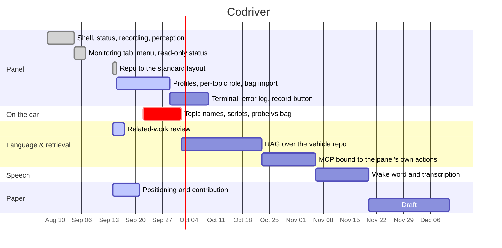

# Codriver — progress

The record of the work. The panel itself is described in
[README.md](../README.md); the working agreement is in
[instructions.md](../instructions.md).

Three sections, all using the **same five area names**, so a row in the
timetable, an entry in the log and a todo can be read against each other:

**Panel** · **On the car** · **Language & retrieval** · **Speech** · **Paper**

> Dates in the timetable are placeholders until the HCII deadline is
> fixed. Only the "done" bars reflect real dates.

---

# Log

## Panel

- **2026-09-14** — Repo moved to the standard layout: flat `codriver/`
  package (no `src/`), hatchling instead of `uv_build`, line length 79,
  `.docs/` tree, `configs/`, `notebooks/`, `third_party/`, HANDOFF and
  instructions. `instructions/` moved inside the package so the notes
  ship with the wheel; `examples/` became `configs/`; screenshots moved
  to `.docs/figures/`. 59 tests, ruff and mypy strict clean throughout.
- **2026-09-07** — Status made read-only: GNSS and lidar left, cameras
  right, every control moved to Monitoring. Visualisation pane collapsed
  to a bar that opens on click. Fixed the 1 s poll destroying scroll
  position — unchanged polls now leave the DOM alone, changed ones
  restore every scroll offset (verified: scrolled to 300, four polls
  later still 300).
- **2026-09-04** — Restructured to five tabs: added Monitoring, gave
  Recording its own tab, merged map/prediction/planning into "Custom
  functionalities", added the burger menu. Named the project **Codriver**
  and published to github.com/max-a-ai/codriver.
- **2026-08-28 → 09-04** — The panel, off the car: sensor registry, four
  rate backends behind one interface (`rclpy` live probe, `bag`,
  `ros2cli`, `mock`), process manager with SIGINT-to-process-group and
  exclusive groups, zero-dependency HTTP server, the whole frontend in
  one static file, per-tab notes, demo config and stand-in scripts.

## On the car

- Nothing yet. Every topic name and expected rate in the config is still
  a guess.

## Language & retrieval

- **2026-09-14** — Related-work review started: the four systems we have
  to be different from are captured in
  [related-work.md](related-work.md).

## Speech

- Nothing yet.

## Paper

- **2026-09-14** — Positioning work started. Target venue HCII.

---

# Todos

## Panel

- [ ] **P1 Build the sensor list from a reference rosbag.** Today the
      sensors, their topics and their expected rates are hand-written in
      the config — the part redone for every vehicle and the part most
      likely to drift from what the car actually publishes.

      Record one bag with every sensor on and at the rate it should run,
      then hand the panel that bag's `metadata.yaml`. The metadata file
      alone is enough; the bag is not needed, and the drop zone already
      exists in the menu under "Configure new vehicle". From it derive:

      - **which sensors exist**, sorted into GNSS, cameras and lidar from
        the topic names and types
      - **the expected rate per sensor**, as `message_count / duration`
        from `topics_with_message_count`, **rounded to the nearest
        0.5 Hz** — 19.87 becomes a target of 20.0, 10.24 becomes 10.0.
        Half-Hz steps because rates in practice land on 10, 20 and the
        occasional 12.5, and rounding harder would erase a real
        difference.
      - **the topic list per sensor**, which is also what the recording
        switches are built from

      The catch to design around: the reference bag has to have been
      healthy. A bag recorded while the GNSS was still at 1 Hz would
      install 1.0 Hz as the target and the panel would report green
      forever. The import must show what it derived and be confirmed
      before it replaces the running config.

- [ ] **P2 Vehicle profiles.** One panel, several vehicles, each a saved
      config the menu switches between:

      | profile | what it is |
      |---|---|
      | `ava` | the car. Eight cameras, seven lidars, GNSS. Today's defaults. |
      | `fusebike` | the bike. A different and much smaller sensor set. |
      | `robowilliam` | a roboracer template. |

      A profile owns everything that makes the panel look the way it does
      for that vehicle: which blocks exist and what they are called, the
      sensors in each, their rates and topics, and which recording group
      buttons make sense. "All cameras" is not a useful button on a
      vehicle with one camera, so blocks and group switches come out of
      the profile rather than being hard-coded. Importing a bag (P1)
      creates or updates one profile — dropping a bike recording must not
      overwrite the car.

      **Blocked:** needs a `metadata.yaml` from fusebike and robowilliam.

- [ ] **P3 Per-topic role, editable in the settings.** Widen
      `critical: true|false` to three states, listed per topic:

      | role | status tab | recording |
      |---|---|---|
      | **required** | counts toward the block; red here fails it | on by default |
      | **not always required** | shown, can go red, never fails the block | off by default |
      | **ignore** | not shown at all | never offered |

      Two of the three already exist, so the change is replacing the
      boolean with a three-valued `role` and filtering `ignore` out
      before the blocks and switches are built. `critical` is read in six
      places (`sensors.py` ×2, `recording.py` ×4). AVA's presets stay the
      defaults but stop being baked into the code.

      **Needs a decision:** does editing a role write straight to disk or
      need a save step? Is `ignore` per profile, or also global?

- [ ] **P4 A terminal in the UI.** Both the missing output view and the
      typed half of the natural-language input, so it is one piece of
      work rather than two.
- [ ] **P5 An error terminal along the bottom of Status.** The other half
      of making Status the screen you read.
- [ ] **P6 A bigger, red, unmistakable record button.**
- [ ] **P7 A legend for what the colours mean.**
- [ ] **P8 Free disk on the recordings volume.** A recording that fills
      the disk halfway through a demo is the failure this catches.
- [ ] **P9 The name of the bag being written**, and the last few, rather
      than just the directory.
- [ ] **P10 Decide whether the sweep should run on a timer.**
      `auto_refresh_seconds` is 0 today. A sweep costs `probe_seconds` of
      subscription and nothing else.
- [ ] **P11 A "check everything" button** that runs the bag backend for
      60 s next to the live numbers, for when the trustworthy answer
      matters more than the fast one.
- [ ] **P12 Wire the per-sensor start / stop / visualise buttons.**
      Disabled placeholders today; needs per-sensor launch files.
- [ ] **P13 Embedded visualisation.** Foxglove is the only one of the two
      that can render inside a browser page: `foxglove_bridge` is a
      WebSocket a browser can consume, and Studio can be self-hosted in
      an iframe. RViz is a Qt desktop app that would have to be
      screen-streamed over noVNC or WebRTC. Measure the bridge's latency
      rather than treating the two as equivalent.
- [ ] **P14 Leave room for a Control tab**, for closed-loop operation.
- [ ] **P15 Fill `codriver/instructions/*.md`** with the real procedures
      from the car computer.
- [ ] **P16 Add a LICENSE.** The repo is public and will back a paper;
      without one nobody can legally reuse the artifact.

## On the car

Ordered so each step is testable on its own. Every item needs the
vehicle.

- [ ] **C1 Capture `ros2 topic list` and `ros2 topic info -v`** for every
      sensor. This is the single biggest source of wrongness right now:
      every topic name in the defaults is a guess.
- [ ] **C2 Confirm the script names in `~/scripts/`** match the config,
      and make `start_recording.sh` forward `"$@"` to `ros2 bag record`.
      Check each script runs from the panel's environment, not just an
      interactive shell — PATH and ROS variables differ.
- [ ] **C3 Run the `rclpy` probe with all sensors up.** Confirm it reports
      20 Hz for cameras and 10 Hz for lidar rather than the low numbers
      `ros2 topic hz` gives.
- [ ] **C4 Cross-check probe against bag.** Record two minutes by hand,
      run the `bag` backend over the same period, compare. If they agree
      the live probe is trustworthy. If they disagree the bag is right
      and the probe's QoS handling needs looking at.
- [ ] **C5 Restart the computer and watch the GNSS.** Open the panel
      before touching it, confirm the top box is red at 1 Hz, set it,
      confirm green. This is the fault the panel exists to catch and a
      restart is the only way to see it.
- [ ] **C6 Set `ready_pattern` per pipeline** from real startup output, so
      orange turns green at the right moment. Pose inference matters most.
- [ ] **C7 Stop a real recording from the panel** and confirm with
      `ros2 bag info` that the bag is complete, readable and holds exactly
      the topics the switches were set to.
- [ ] **C8 Decide the bind address.** Localhost only, or the car network
      so a tablet can open it. See open question 9.

## Language & retrieval

- [ ] **L1 Finish the related-work review** and write the positioning
      paragraph. See [related-work.md](related-work.md).
- [ ] **L2 RAG over the vehicle's own repository.** The claim to defend:
      every sensor-mounted vehicle is a one-off, so the retrieval corpus
      is *this* vehicle's launch files, configs, URDF, scripts and notes,
      not general ROS documentation.
- [ ] **L3 A local model.** Ollama, small Qwen. Runs on the car compute
      with no network.
- [ ] **L4 MCP bound to the panel's own actions.** The model may call
      exactly what a person can click — start/stop a sensor, a recording,
      a pipeline, and the recording switches — and nothing else. The
      panel's existing API is the whole tool surface.
- [ ] **L5 Fold the per-tab notes into the retrieval corpus**, so the
      right rail becomes a question you can ask rather than a file you
      open.
- [ ] **L6 Emit a panel config as structured output**, for the setups a
      bag alone cannot describe.

## Speech

- [ ] **S1 Wake word.** "Codriver".
- [ ] **S2 Transcription.** Whisper or something better suited to a noisy
      cabin.
- [ ] **S3 One input path shared by the microphone and the terminal**, so
      spoken and typed commands reach the same code.

## Paper

- [ ] **W1 Positioning against the four systems** in
      [related-work.md](related-work.md).
- [ ] **W2 Decide the evaluation.** What claim is being tested, and with
      what — task completion time against a terminal, error rate,
      something with real users?
- [ ] **W3 Confirm the HCII deadline** and fix the timetable dates.

---

# Open questions

## Answered

- **GNSS failure mode.** It comes up at 1 Hz after a computer restart and
  stays there until somebody sets it. So the rate is genuinely wrong, not
  stale data at the right rate, and measuring the rate is the correct
  instrument. It also means the check matters most in the first minutes
  after a restart, which is why the GNSS box sits first.
- **The fourth perception signal.** It was mapping, and it is somebody
  else's standalone task, so it moved out. Perception stays at three.
- **Script location.** Everything the panel runs is in `~/scripts/`.
- **Screen shape.** Portrait. The rails are fixed at 160 px and 76 px so
  only the centre column shrinks.
- **Recording topic selection.** Built: a switch per camera and per
  lidar, group switches per column, and the result passed to the script
  as arguments and as `CODRIVER_TOPICS`.
- **RViz vs Foxglove for embedding.** Foxglove. Only it can render in a
  browser page at all; see P13.

## Blocking, and only answerable on the car

1. **Topic names.** What does each of the 16 sensors actually publish on?
   The defaults assume `/<sensor_name>/image_raw` and
   `/<sensor_name>/points`, which is a convention, not knowledge.
2. **GNSS topic and message type.** The failure mode is settled, the
   topic name is not.
3. **Recording script contract.** The panel appends the selected topics
   as arguments and sets `CODRIVER_TOPICS`. The script has to forward one
   of the two rather than carry its own list. What is it called, and
   where does it write? The panel assumes `~/recordings/`.
4. **Camera topic shape.** Each camera contributes `image_raw` and
   `camera_info`. If they publish compressed images, or put `camera_info`
   elsewhere, `record_topics` per sensor is where that is fixed.
5. **Pipeline launch commands.** The exact command for preprocessing,
   detection and pose inference.
6. **Do the operating-mode scripts need sudo?** If they prompt for a
   password they hang silently when started from the panel.
7. **Python and rclpy.** Which Python is on the car compute, and can it
   `import rclpy` after sourcing ROS? The panel targets 3.10.

## Needs a decision from you

8. **Should the lidar IMU go into the bag?** Only `points` is recorded
   today. Adding the IMU is one entry per lidar in `record_topics`.
9. **Who should reach the panel?** It binds `127.0.0.1`, so only the car
   compute can open it. Binding `0.0.0.0` puts it on the car network,
   where anything on that network can start a recording or stop a
   pipeline. There is no authentication. A decision about the network,
   not the code.
10. **Should closing the panel stop the demo?** It does today, so a
    closed panel never leaves an invisible recorder holding a bag open.
    The other reading is that the demo should survive a panel restart.
11. **Two browsers.** Nothing stops two tabs both pressing start. The
    backend refuses the second start, so the worst case is a confusing
    moment rather than two recorders.
12. **Fisheye rate.** Listed at 20 Hz like the others. If it runs at a
    different rate, one config line fixes it; until then it shows red.

## Worth confirming, not urgent

13. **Tolerance.** 15 percent of nominal, so 20 Hz passes between 17 and
    23. If cameras normally sit at 19.2 that is fine; at 16 the tolerance
    and the expectation are both wrong.
14. **Probe window.** Two seconds per sweep. If the numbers look noisy on
    the car, raising it is one config key.
15. **Which notes to copy off the car.** One file per tab, wholesale.
