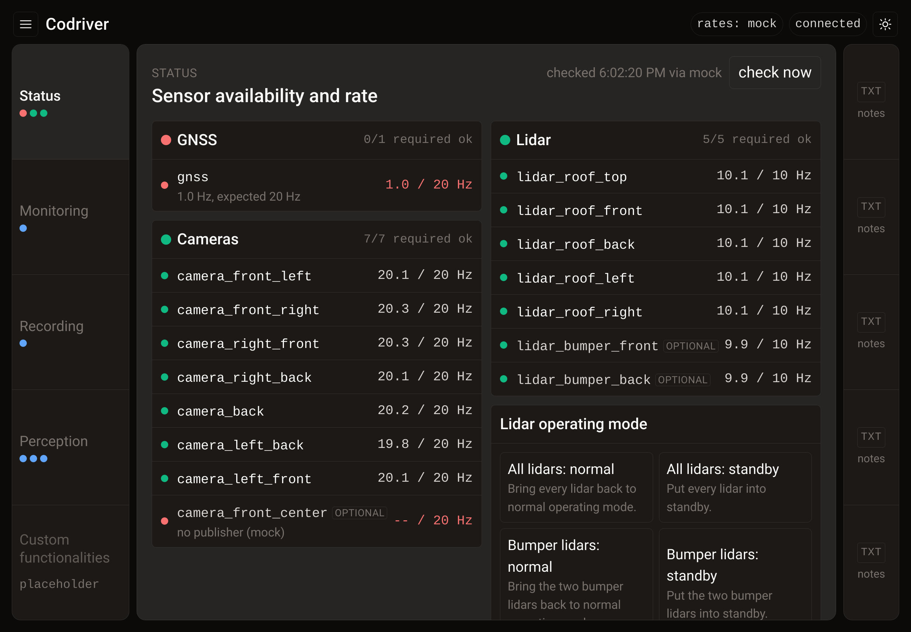
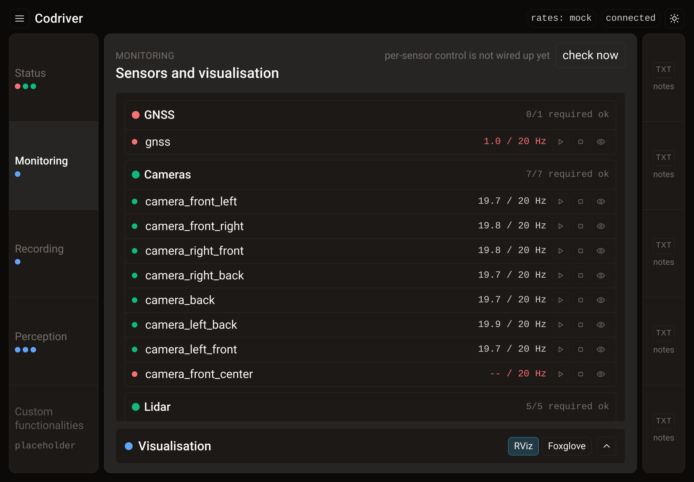
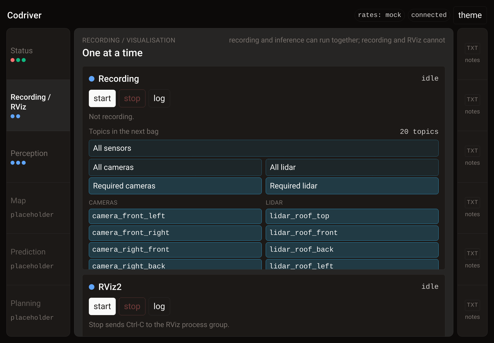

# Codriver

A control panel for a ROS 2 research vehicle, opened in a browser on the car
compute. It does two jobs: tell you at a glance whether the sensors are healthy,
and start and stop the demo the way you would from a terminal, without the
terminal.



The backend runs the scripts and measures the sensors. The frontend is one HTML
file served by that same backend, so there is one process and one port. No
framework, no build step, no CDN, and no Python dependencies at all.

```bash
python -m codriver        # then open http://127.0.0.1:8420
```

## Try it in one minute

You do not need a car, or ROS, to see the whole panel. The demo config runs
against invented sensors and stand-in scripts:

```bash
git clone <this repo> && cd codriver
uv sync --extra dev
CODRIVER_CONFIG=examples/demo.json uv run python -m codriver --open
```

The demo scenario deliberately shows the two faults worth seeing — a GNSS stuck
at 1 Hz and a dead fisheye — so the panel can be judged in the state that
matters. `CODRIVER_MOCK_SCENARIO=healthy` makes everything green.

## The name

A rally co-driver does not drive. They read the notes aloud, work the car's
systems, and keep talking to the driver for the whole stage. That is the job
this panel is growing into: it watches the sensors, holds the per-tab notes, and
— once the speech and LLM layers land — answers out loud when you ask it
something with your hands on the wheel.

It is also meant to be said. `Codriver` is the wake word.

## What is on screen

Three columns. Both rails are a fixed width, sized to what they hold; the centre
takes whatever is left. The screen in the car is portrait, so narrowing the
window only ever shrinks the tab you are working in, and the tab labels and
notes buttons never reflow.

The left rail is five vertical tabs, 160 px wide. The right rail is 76 px, split
into the same five rows, one notes button per row, each opening that tab's note
from `instructions/`. The centre is never split and always shows the tab you
picked. Status is what opens first. Each tab carries its own summary lights in
the rail, so the rail alone answers "is anything wrong".

A burger button at the top left opens the menu: which visualiser the Monitoring
tab should use, and stubs for the model, speech and retrieval settings that the
language work will need.

### Status

GNSS and the seven lidars on the left, the eight cameras on the right. GNSS
leads because it is the one that comes up wrong. Green means the topic is being
published at the rate it should be. Red means it is absent, silent, or off rate.
Three sensors are listed but marked optional, and their failing does not turn
their box red: the front-centre fisheye, which is never recorded, and the two
bumper lidars.

**Status has no controls at all.** Not the operating-mode buttons, not even the
sweep button — they are all on Monitoring. This is the screen you read, not the
one you act on, which means glancing at it can never be the thing that made the
car busy. Two fixed columns rather than a flow, so which side a sensor lives on
does not move when a block changes height; the portrait screen in the car
collapses them back to one.

A block longer than ten sensors splits into two columns of its own rather than
running off the bottom of the screen.

| group | sensors | expected |
|---|---|---|
| GNSS | gnss | 20 Hz |
| cameras, required | front_left, front_right, right_front, right_back, back, left_back, left_front | 20 Hz |
| cameras, optional | front_center (fisheye) | 20 Hz |
| lidar, required | roof_top (OS2), roof_front and roof_back (OS1), roof_left and roof_right (OS0) | 10 Hz |
| lidar, optional | bumper_front, bumper_back | 10 Hz |

On the lidar side, only `points` is recorded. Ouster units also publish `imu`,
and optionally `scan`, `metadata` and the range, signal and reflectivity images.
None of those are in the bag by default; `record_topics` per sensor in the
config adds any of them.

The GNSS is the reason the rate check exists at all. It comes up at 1 Hz after
the computer is restarted and stays there until somebody sets it; once set it
holds for the rest of the session. There is exactly one moment where it is
wrong, right at the start, and that is the moment nobody is looking. Open the
panel after a restart and the top box answers it.

### Monitoring



Status tells you something is wrong; this is where you do something about it.
Every sensor gets a row with its live rate and three controls — start, stop,
visualise.

Those three are **disabled on purpose**. The panel can read a sensor's rate, but
it has no per-sensor driver control yet and nothing to render a single topic
into. The row is here so the layout is settled before the wiring exists, and the
buttons say so on hover rather than looking live and doing nothing.

The lidar operating-mode buttons live here too, under the sensor blocks, along
with the sweep button. Everything that does something is on this tab.

The visualisation pane at the bottom is **collapsed to a bar by default** and
opens to half the tab when you click it — the sensor list is what you came here
for, and the pane is empty until something is embedded in it. The state is
remembered per browser. The RViz / Foxglove buttons on the bar are a mock-up:
they change what the pane says it will show and nothing else.

### Recording



The visualiser used to share this tab; it moved to Monitoring, and recording now
has the screen to itself. The two still share an exclusive group in the backend,
because the car can record or visualise but not both, so each says why the other
is unavailable. Recording and inference are free to run together. Stop is a real
Ctrl-C: SIGINT to the child's process group, so a bag closes cleanly instead of
being truncated.

The recording half carries a switch per sensor, light blue when it is going into
the bag and greyed back when it is not. Three rules it encodes:

- **A camera is two topics.** Switching a camera on adds its `image_raw` and its
  `camera_info` together. An image recorded without its calibration is a bag
  nobody can use afterwards, so the two are never separable.
- **The default is what matters.** Every camera except the front-centre fisheye,
  every lidar except the two bumper units. The optional ones sit at the bottom
  of their column and start off, so recording one is a deliberate act.
- **A group button that is fully on turns off.** Anything else turns fully on,
  which is what makes a half-lit "All cameras" useful rather than confusing.

The selected topics are handed to the recording script as arguments, and also as
`CODRIVER_TOPICS`, so adapting the script is a matter of forwarding whichever is
more convenient:

```bash
#!/usr/bin/env bash
exec ros2 bag record -o ~/recordings/"$(date +%Y%m%d_%H%M%S)" "$@"
```

This is the part that removes a recurring nuisance: keeping a hand-written
`--packages-select` list in sync with what you actually meant to record. Always-on
topics live in the config, optional ones are switches, and the command is
assembled for you.

The switches lock while the recorder is running, because changing them would do
nothing to the bag already being written. Starting with nothing selected is
refused rather than producing an empty bag.

The GNSS has no switch. It is small, it is always wanted, and a recording that
quietly lost it is worthless, so it is pinned on and said so under the columns.

### Perception, and the placeholders

**Perception** is the three pipelines stacked, each with a light. Blue for never
started, orange while initializing, green when running, red when it crashed.
Pose inference is the reason orange exists: it spends most of a minute loading a
checkpoint, and a green light during that window would be a lie.

**Custom functionalities** holds map, prediction and planning, one section each.
They were three separate tabs, which cost three rows of the left rail and told
you nothing the first one did not. All three are somebody else's work; if one
grows past a section it gets its own tab back. Mapping started as a fourth
perception signal and moved out because it is a separate person's work rather
than a stage of this pipeline, which is what leaves perception at three.

## Running it on the car

```bash
source /opt/ros/humble/setup.bash
python3 -m codriver
```

Nothing else. See [Why no dependencies](#why-no-dependencies).

## Configuring it for a given car

Topic names, script paths and launch commands are deployment facts, so they live
in one JSON file rather than in the code. The built-in defaults are guesses that
have to be replaced with what the car actually publishes.

```bash
python -m codriver --dump-config --defaults > ~/.config/codriver/config.json
```

That writes every key out, ready to edit. The file is looked for at
`$CODRIVER_CONFIG`, then `./codriver.json`, then
`~/.config/codriver/config.json`. Any key you leave out keeps its default. An
unknown key is an error rather than a silent no-op, because a typo in a topic
name on a car is expensive.

## Measuring rates honestly

`ros2 topic hz` under-reports on exactly the topics this panel cares about, for
two reasons:

1. It subscribes with a reliable QoS. Sensor drivers publish best effort. The
   two never match, so it sees a filtered subset or nothing at all.
2. It deserialises every message in Python. That cannot keep up with 20 Hz of
   camera frames or an OS2 sweep, so it reports what it managed to process
   rather than what arrived.

Which is why recording a bag and counting afterwards is the method that gets
trusted. Four backends are implemented, selected with `ros_backend` in the
config or `--backend`:

| backend | how it measures | use it for |
|---|---|---|
| `rclpy` | subscribes directly, matching each publisher's advertised QoS, counting messages as raw undeserialised bytes | the default, and the one to trust |
| `bag` | records a short bag, divides message count by bag duration | the arbiter, when you want to know what a recording would contain |
| `ros2cli` | shells out to `ros2 topic hz` | fallback where rclpy cannot be imported; treat as a lower bound |
| `mock` | invented | developing off the car |

The `rclpy` probe fixes both failure modes: it reads each publisher's QoS from
the graph and matches reliability and durability, and it subscribes with
`raw=True`, so a message is counted without ever being deserialised. The rate
comes from the interval between the first and last message actually seen, not
from the requested window, so a probe that opens just after a frame is not
biased low. It runs as a short-lived child process, so a broken ROS environment
fails one sweep instead of taking the panel down.

`auto` picks `rclpy` when a ROS environment is present and `mock` otherwise, so
the same config file works on the car and on a laptop.

> The two live backends have not yet been run against real sensors. Confirming
> them against the bag backend on the car is the first task in
> [PROJECT_PLAN.md](PROJECT_PLAN.md).

## Why no dependencies

The backend is standard library only. Not for purity: the panel has to run in
the same interpreter that can `import rclpy`, and that is the ROS-sourced system
Python. Putting FastAPI in there means a virtualenv with
`--system-site-packages` or a `pip install --user`, which is a deployment
problem on a car with no reason to exist. With zero dependencies the panel is
`source setup.bash && python3 -m codriver` and everything, including the live
rate probe, works.

The practical effect is that Codriver runs anywhere CPython 3.10 does. The
panel itself is close to free — one static file, a 1 s poll of a few hundred
bytes, and a rate sweep that runs on demand rather than continuously. What
decides your hardware is ROS 2 and the sensor traffic, not this UI.

`uv` is still used for development, and `pyproject.toml` carries ruff and mypy
strict.

## Layout of the code

```
src/codriver/
  config.py       sensors, processes and commands for this car; the JSON loader
  sensors.py      readings to lights; which red drags its block down
  processes.py    start, watch and Ctrl-C the children; the exclusive groups
  recording.py    which sensors go into the next bag, and the topics that means
  app.py          application state and the JSON the browser gets
  server.py       HTTP: static file on one side, small JSON API on the other
  ros/
    backend.py    the interface every rate backend implements
    live.py       the rclpy probe, and the child process that runs it
    bag.py        record a short bag and count
    cli.py        ros2 topic hz
    mock.py       invented readings
  static/
    index.html    the whole frontend
instructions/     one <tab-id>.md per tab, opened by the right-hand rail
examples/         a demo config plus stand-in scripts, for driving it off the car
docs/img/         the screenshots in this README
```

## Notes behind the right-hand rail

One file per tab in `instructions/`, named after the tab id. The panel reads
them on every request, so editing `instructions/status.md` and hitting the
button again shows the new text without a restart. They are in the repo rather
than on the car so they are version controlled and reviewed like anything else;
`instructions_dir` in the config points somewhere else if you would rather.

Several are placeholders with a TODO line, waiting for the equivalents from the
car computer.

## Tests

```bash
uv run pytest
```

57 tests covering the sensor registry against what is bolted to this car, the
red and green rules, the process lifecycle including the SIGINT path and the
exclusive group, the HTTP surface against a real socket, and a Ctrl-C of the
whole panel in a real subprocess to prove it exits and takes its children with
it. `ruff` and `mypy --strict` are clean.

## Status

Done:

- [x] three-column shell, five vertical tabs, right rail split to match
- [x] status tab: read-only, GNSS and lidar left, cameras right, nothing
      below the fold and no controls at all
- [x] monitoring tab: per-sensor rows with start / stop / visualise, the lidar
      operating-mode buttons, the sweep button, and the pane the visualiser
      will be embedded into
- [x] recording on its own tab, still mutually exclusive with the visualiser,
      stop is a real Ctrl-C
- [x] per-sensor recording switches, group switches, topics passed to the script
- [x] perception tab: three pipelines, four-state lights
- [x] map, prediction and planning as sections of one tab
- [x] burger menu: visualiser choice, and stubs for model, speech, retrieval
      and "configure new vehicle"
- [x] four rate backends including the live rclpy probe
- [x] config file for topics, scripts and launch commands
- [x] per-tab notes in `instructions/`, loaded from the repo
- [x] mock backend, demo config and stand-in scripts
- [x] tests, ruff, mypy strict

Blocked on the car:

- [ ] replace the guessed topic names with what the car publishes
- [ ] replace the guessed script paths with the real ones
- [ ] confirm the rclpy probe against the bag backend on real sensors
- [ ] fill the per-tab notes with the real procedures from the car

## Roadmap

Codriver is the UI half of a larger system. The plan is to keep this repository
as the panel and its API, and to add the language and speech layers as separate
codebases that drive it through the same commands a human can click.

**The panel**

- [x] a **Monitoring** tab: one control per sensor, the way a container
      dashboard gives you one per service, with a visualisation pane below
- [ ] wire those per-sensor buttons to real per-sensor start / stop / restart
- [ ] embedded visualisation. Foxglove is the only one of the two that can
      actually render inside a browser page: `foxglove_bridge` is a ROS node
      exposing a WebSocket, and the Studio web build can be self-hosted and put
      in an iframe. RViz is a Qt desktop application and cannot render into a
      page at all — showing it in the panel would mean streaming its window over
      noVNC or WebRTC, which is a heavier and worse-looking hop than the
      bridge. So: measure the bridge's latency and decide whether it is good
      enough, rather than treating the two as equivalent options
- [x] make **Status** strictly non-interactive: the operating-mode and sweep
      buttons moved to Monitoring
- [ ] put an error terminal along the bottom of Status
- [ ] a bigger, red, unmistakable record button
- [ ] a legend for what the colours mean
- [ ] a terminal view
- [ ] leave room in the architecture for a **Control** tab, for closed-loop
      operation
- [x] stop the 1 s re-render fighting you: an unchanged poll now leaves the DOM
      alone entirely, and a changed one puts every scroll position back

**Language and retrieval**

- [ ] a local LLM (Ollama, small Qwen) with RAG over the car's `.pdf`, `.txt`
      and `.sh` documentation
- [ ] expose the panel's actions over MCP, restricted to exactly the commands
      the UI already offers — start/stop sensors, recording and perception, and
      the per-sensor recording switches — so the model can never do something a
      person could not do from this screen
- [ ] fold the per-tab notes into the retrieval corpus, so the right rail
      becomes a question you can ask rather than a file you open

**Speech**

- [ ] wake word plus spoken command understanding, so "Codriver, activate all
      lidars" reaches the same code path as the switch
- [ ] one input path shared by the microphone and a text box

**Further out**

- [ ] **build the sensor list from a reference rosbag.** Record one bag with
      every sensor on and at the rate it should run, then drag that bag's
      `metadata.yaml` onto the panel. The drop zone is already in the menu under
      "Configure new vehicle"; today it only reports the file it was given.
      From the metadata the panel derives which sensors exist, sorts them into
      GNSS, cameras and lidar, takes each one's topic list, and computes its
      rate as `message_count / duration` **rounded to the nearest 0.5 Hz** —
      19.87 becomes a target of 20.0. Those become the `expected_hz` the live
      readings are judged against, so the lights are measured against a
      known-good recording rather than a number somebody typed into
      `config.json`. Dragging the metadata file is enough; the bag itself is not
      needed. The import has to show what it derived and be confirmed before it
      replaces the running config — a reference bag recorded while the GNSS was
      still at 1 Hz would otherwise install 1.0 Hz as the target and report
      green forever.
- [ ] **vehicle profiles.** One panel, several vehicles, each a saved config
      the menu can switch between: `ava` (the car, today's defaults),
      `fusebike` (the bike) and `robowilliam` (a roboracer template). A profile
      owns everything that makes the panel look the way it does for that
      vehicle — which blocks exist and what they are called, the sensors in
      each, their rates and topics, and which recording group buttons make
      sense. Importing a bag creates or updates one profile, so dropping a bike
      recording cannot overwrite the car.
- [ ] **a per-topic role, editable in the settings**: required / not always
      required / ignore, listed for every topic the profile knows about. The
      first two already exist as `critical: true|false`; the new one is
      `ignore`, which drops a topic from the status blocks and the recording
      switches entirely. This is what replaces hand-editing `config.json` to
      change which cameras count as required.
- [ ] have the model emit that config as a structured output, for the setups a
      bag alone cannot describe

The full plan and every open question is in [PROJECT_PLAN.md](PROJECT_PLAN.md).
